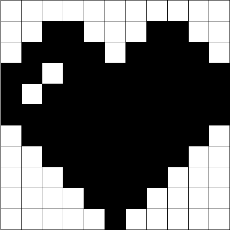

# etch-a-sketch
🎉 [Check it out here!](https://freshmre.github.io/etch-a-sketch/)

Paint a resizable grid by hovering over the cells. This project is from [The Odin Project](https://www.theodinproject.com/paths/foundations/courses/foundations/lessons/etch-a-sketch-project).

# To Do
🔴 Add pen color picker

🔴 Add rainbow pen

🔴 Add size slider and clear button

🔴 UI improvement (Title, background, credits)

🔴 Responsiveness
